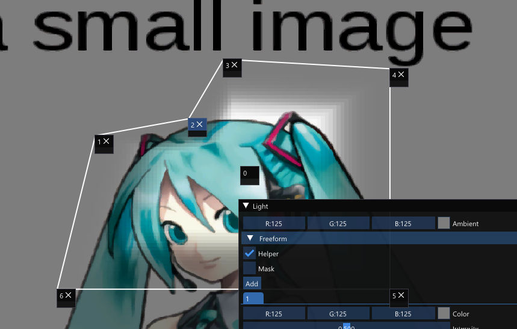

# features
## freeform mask
* mask with free editing mesh
* you can edit whether adding or removing vertices to mesh for mask
* introducing from Unity: [video](https://youtu.be/0xnYbhqRDkM?t=1079)
## waifu2x-async
* waifu2x is image scaler that is driven by deep learning
* app uses [waifu2x-converter-cpp](https://github.com/DeadSix27/waifu2x-converter-cpp)
* app converts textures asynchronously without blocking

# screenshot

# dependency
* it needs [DirectX 9 SDK](https://www.microsoft.com/en-us/download/details.aspx?id=6812) installation
* Visual Studio 2019 <=